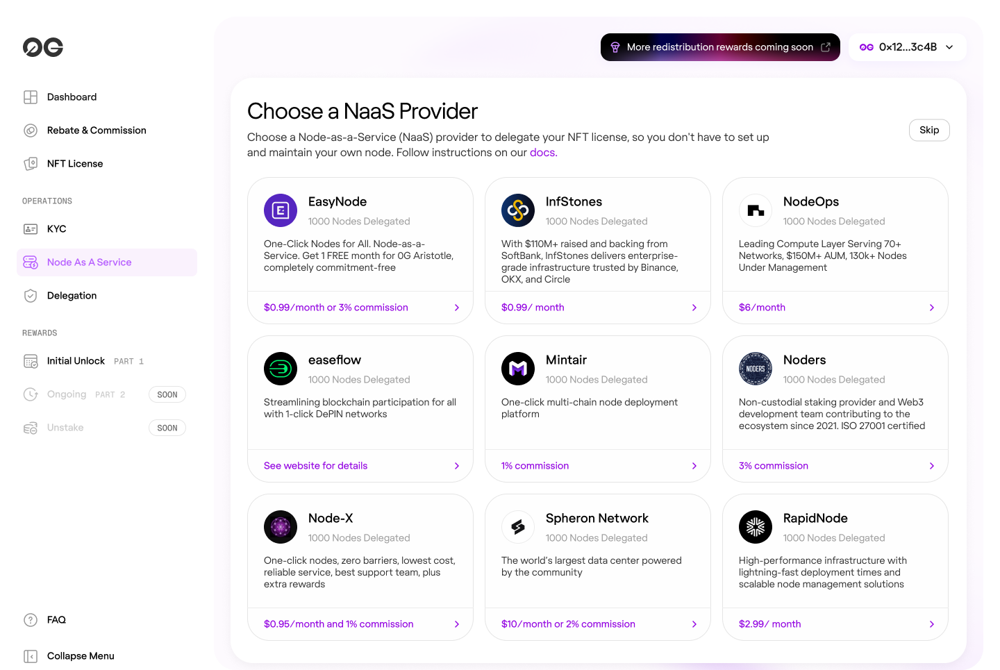
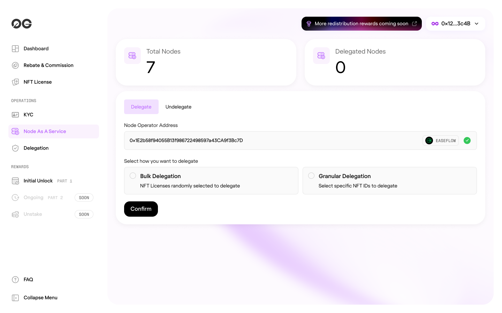

# 0G AI Alignment Node - Guide
---

::::info **Who this is for & what you'll learn**
- Run your own Alignment Node or delegate to a NAAS provider
- Understand system requirements, setup steps, and monitoring
- Learn NAAS models (commission vs prepaid) and how to delegate/undelegate
::::

## Overview

The 0G AI Alignment Node system allows license holders to participate in the network either by running their own nodes or delegating to Node as a Service (NAAS) providers. This guide covers both options to help you choose the best approach for your needs.

## Choose Your Path

### Quick decision summary

| Option | Best for | Setup time | Rewards | Maintenance |
|-------|----------|-----------|---------|-------------|
| **Option 1: [Delegate to NAAS](#option-1-delegating-to-naas-providers)** | Non-technical users | 2-3 Minutes | 100% (prepaid) or minus commission | Provider handles |
| **Option 2: [Run your own](#option-2-running-your-own-node)** | Technical users | 1-2 Hours | 100% | You handle |


### Option 1: Delegate to NAAS Provider
**Best for:** Users who prefer a managed solution without technical overhead.

**Benefits:**
- No technical expertise required
- No infrastructure maintenance

### Option 2: Run Your Own Node
**Best for:** Technical users who want full control over their node infrastructure and 100% of rewards.

**Requirements:**
- Technical knowledge to manage a server
- Dedicated hardware or VPS meeting minimum specifications
- Time for ongoing maintenance and monitoring

---

## Option 2: Running Your Own Node

### System Requirements

Before setting up your node, ensure your system meets these minimum specifications:

| Component | Minimum Requirement |
|-----------|-------------------|
| **RAM** | 64 MB |
| **CPU** | 1 x86 Core @ 2.1GHz |
| **Disk Space** | 10 GB |
| **Internet** | 10 Mbps connection |
| **Network** | Port must be externally accessible (configure in firewall) |

### Installation & Setup

#### Step 1: Download the Node Binary

Download the latest 0G alignment node binary from the official repository:

```bash
# Download the binary (replace with actual URL)
wget https://github.com/0gfoundation/alignment-node-release/releases/download/v1.0.0/0g-alignment-node
chmod +x 0g-alignment-node
```

#### Step 2: Configure Environment

1. Copy the example environment file:
```bash
cp .env.example .env
```

2. Edit the `.env` file with your configuration:
```bash
nano .env
```

3. Configure the following parameters:
```bash
export ZG_ALIGNMENT_NODE_LOG_LEVEL=debug
export ZG_ALIGNMENT_NODE_SERVICE_PORT=8080
export ZG_ALIGNMENT_NODE_SERVICE_PRIVATEKEY=your_private_key_here
```

**Important Configuration Notes:**
- **LOG_LEVEL**: Set to `debug` for troubleshooting, `info` for normal operation
- **SERVICE_PORT**: Default is 8080. Ensure this port is open and accessible externally
- **PRIVATEKEY**: Your wallet's private key that holds the alignment node license(s)

#### Step 3: Network Configuration

::::warning **Open your service port**
The port specified in your configuration (default `8080`) must be accessible externally for consensus communication.

Make sure this port is open in:
- Cloud security groups/firewalls (AWS, Azure, GCP, etc.)
- VPS provider firewalls
- Local server firewall rules

Steps vary by provider; consult your host's docs.
::::

#### Step 4: Start Your Node

1. Load environment variables:
```bash
source .env
```

2. Start the node:
```bash
./0g-alignment-node start
```

3. To run in background (recommended for production):
```bash
nohup ./0g-alignment-node start > node.log 2>&1 &
```

### Monitoring Your Node

Check node status:
```bash
./0g-alignment-node status
```

View logs:
```bash
tail -f node.log
```

::::tip **Healthy node checklist**
- Status reports without errors
- Logs show steady activity, no repeated crashes
::::

### Troubleshooting

**Node not connecting:**
- Verify port is open and accessible externally
- Check your firewall/security group settings
- Ensure private key has associated licenses

**Node crashes:**
- Check logs for errors
- Verify system requirements are met
- Ensure stable internet connection

---

## Option 1: Delegating to NAAS Providers

### Understanding NAAS Models

NAAS providers offer two delegation models:

#### Commission-Based Model
- **How it works:** NAAS provider takes a percentage of your rewards as commission
- **Payment:** No upfront payment required
- **Status:** Nodes start as "Active" immediately
- **Best for:** Users who prefer sharing rewards over upfront payments

#### Prepaid Model
- **How it works:** Pay a fixed fee upfront for node operation
- **Payment:** One-time or recurring prepaid fee
- **Status:** Nodes start as "Expired" until payment is confirmed
- **Best for:** Users who want predictable costs

### How to Delegate

#### Step 1: Choose a NAAS Provider

1. Access the [0G Claim Portal](https://claim.0gfoundation.ai)
2. Navigate to the NAAS Providers section
3. Review available providers:
   - **Name & Description**: Provider details
   - **Commission Rate**: Percentage for commission-based model
   - **Prepaid Price**: Cost for prepaid nodes
   - **Reputation**: Community ratings and uptime statistics

   

#### Step 2: Complete Provider Onboarding

1. Visit the selected NAAS provider's platform (URL provided in portal)
2. Complete their onboarding process:
   - Create an account
   - Choose delegation model (commission or prepaid)
   - If prepaid, complete payment
3. Receive your **Target NAAS Node Address** from the provider

**Important:** Save this address - you'll need it for delegation.

#### Step 3: Delegate Your Licenses

1. Return to the 0G Portal
2. Login with your wallet containing licenses
3. Navigate to "My Licenses"
4. Select license(s) to delegate
5. Choose "Delegate" action
6. Enter the **Target NAAS Node Address** provided by your NAAS provider
7. Confirm the transaction



#### Step 4: Monitor Delegation Status

Your delegation will show different statuses:

| Status | Description |
|--------|------------|
| **Inactive** | License not delegated |
| **Pending** | Delegation submitted, awaiting NAAS approval |
| **Delegated** | Active and earning rewards |
| **Expired** | Prepaid period ended or payment issue |

### Managing Your Delegation

#### Checking Status
1. Access the 0G Portal
2. Navigate to "My Licenses"
3. View delegation status for each license

#### Undelegating
To reclaim your licenses:

1. Select delegated license(s)
2. Choose "Undelegate"
3. Confirm the transaction
4. Licenses immediately return to "Inactive" status

**Note:** Undelegation is immediate and doesn't require NAAS approval.

#### Switching Providers
1. First undelegate from current provider
2. Wait for transaction confirmation
3. Follow delegation steps with new provider

### NAAS Payment Management

#### For Commission-Based:
- Rewards automatically distributed after commission deduction
- No action required from you
- Monitor earnings in the portal

#### For Prepaid:
- Track expiration dates
- Renew before expiration to avoid downtime
- Provider will update status upon payment
- Node shows "Expired" if payment lapses

---

## Best Practices

### For Self-Hosted Nodes
1. **Regular Updates**: Keep node binary updated
2. **Monitoring**: Set up alerts for downtime
3. **Backup**: Keep secure backup of private keys
4. **Security**: Use dedicated wallet for node operation
5. **Network**: Ensure stable internet connection

### For NAAS Delegation
1. **Research Providers**: Check reputation and uptime history
2. **Understand Terms**: Read commission rates and prepaid terms
3. **Monitor Status**: Regularly check delegation status
4. **Payment Tracking**: Set reminders for prepaid renewals
5. **Diversification**: Consider splitting licenses across providers

---
